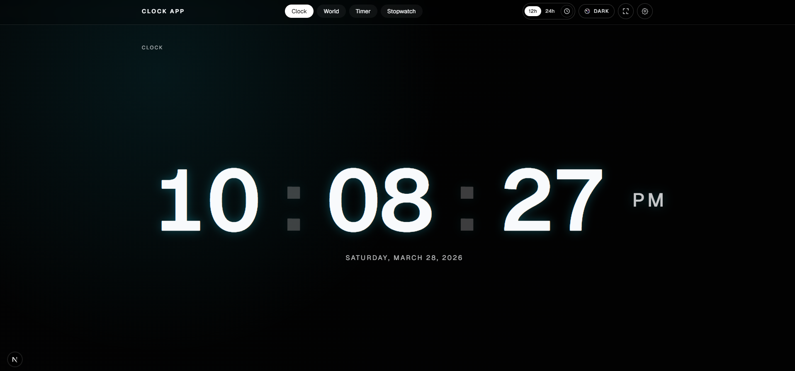
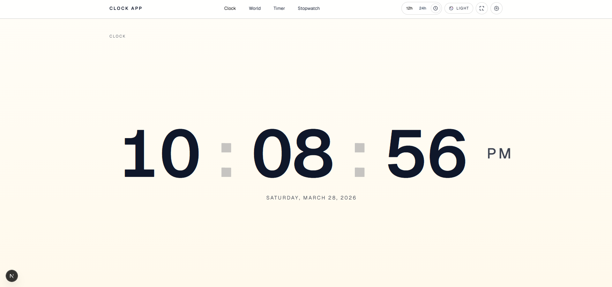
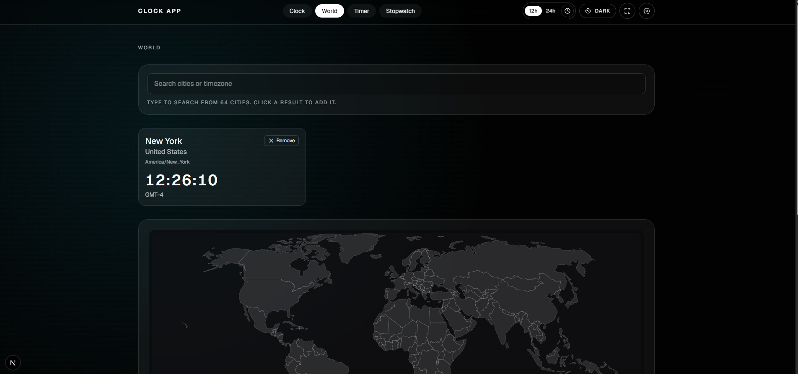
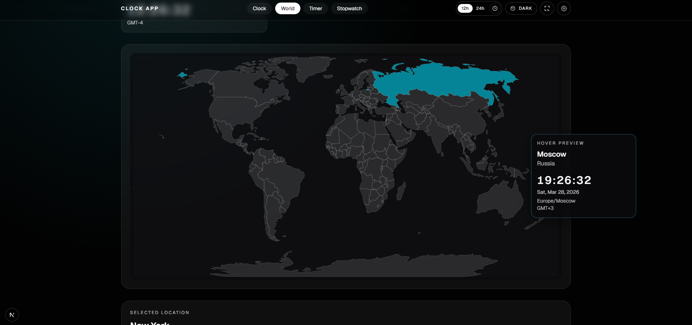
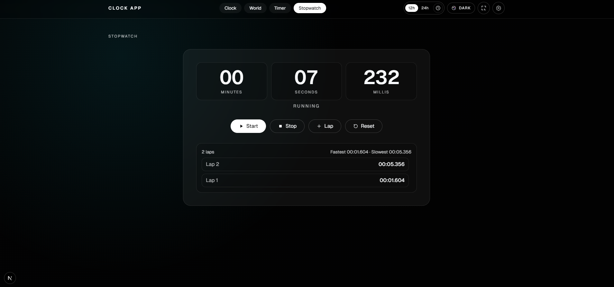
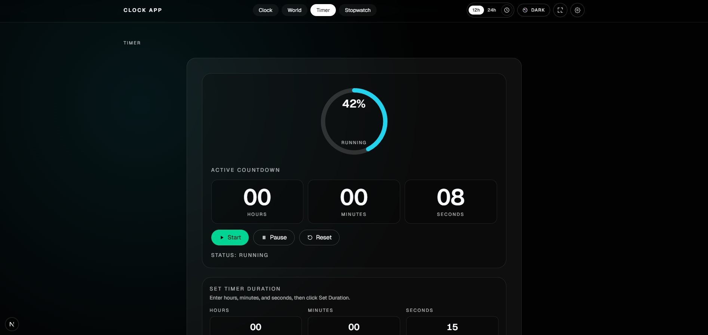

# Clock App

Modern, production-ready clock suite built with Next.js App Router, TypeScript, Zustand, and Tailwind CSS.

## Live Demo

- Production URL: https://clock.nishantkhadka.com.np/

## Main Features

### 1) Clock Module

- Fullscreen-focused digital clock
- 12h / 24h toggle
- Optional seconds and date display
- Blinking colon animation
- Multiple clock styles:
  - Classic digital
  - Split digits
  - Segmented style
  - Thin minimalist style
  - Analog clock mode
  - Flip clock mode

### 2) Analog Clock Module

- SVG analog clock with smooth hand movement
- Configurable dial style (`classic`, `modern`, `minimal`)
- Roman numeral toggle
- Tick-mark toggle
- Second-hand toggle
- Accent modes (`dark`, `light`, `color`)

### 3) Flip Clock Module

- Mechanical-style flip animation
- Responsive and enlarged cards
- Optional seconds support

### 4) World Clock Module

- Add/remove world cities with live updates
- City/timezone search from expanded timezone list
- Interactive real world map (clickable countries)
- Hover preview card near cursor with country time details

### 5) Timer Module

- Set duration via HH:MM:SS
- Start / Pause / Reset controls
- Progress ring with status indicator
- Countdown-to-target datetime block
- Completion chime (“ting”) on finish
- Persists while navigating across pages

### 6) Stopwatch Module

- Millisecond precision stopwatch
- Lap tracking with fastest/slowest markers
- Persists while navigating across pages

### 7) Settings Drawer

- Theme selector
- Clock style selector
- Time format controls
- Visibility controls (seconds/date)
- Analog options (shown only when analog style is selected)

### 8) UX & App-Level Features

- Keyboard shortcuts:
  - `T` → Timer
  - `S` → Stopwatch
  - `W` → World Clock
- Fullscreen mode support
- PWA baseline (`manifest`, service worker registration)

## Theme Support

- dark
- light
- neon
- grayscale
- gradient
- glass

## Routes

- `/clock`
- `/world`
- `/timer`
- `/stopwatch`

## Screenshots

<div>
  
</div>
<div>
  
</div>
<div>
  
</div>
<div>
  
</div>
<div>
  
</div>
<div>
  
</div>

## Local Development

```bash
npm install
npm run dev
```

Open http://localhost:3000.

## Build for Production

```bash
npm run build
npm run start
```
